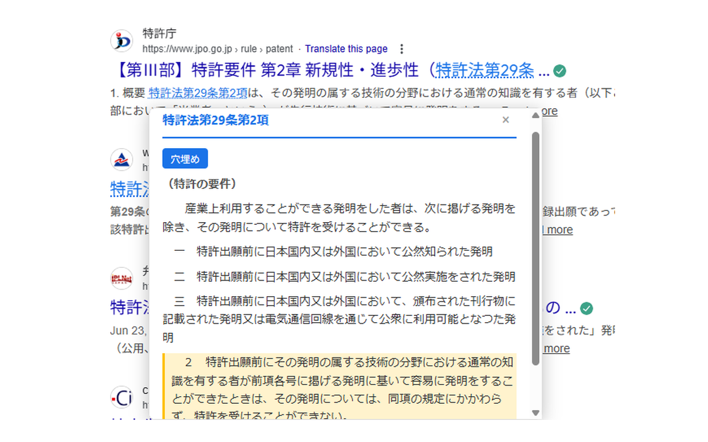
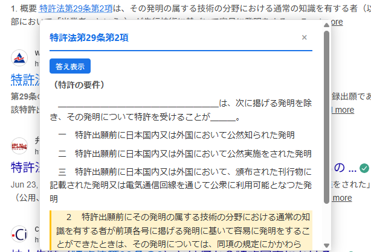
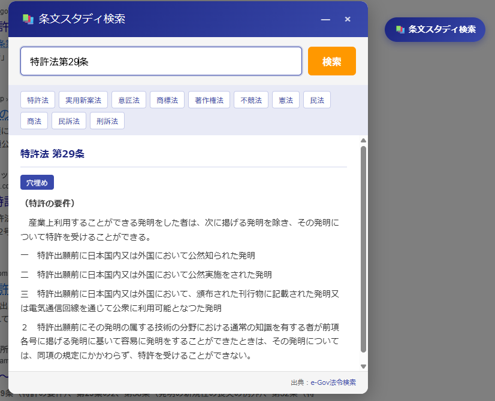

# 条文スタディ

[](LICENSE)
[](https://chrome.google.com/webstore)
[](https://developer.chrome.com/docs/extensions/mv3/)

**条文スタディ**は、Webページ上の法令参照（「特許法第1条」など）を自動検出し、e-Gov法令検索APIから条文を取得してポップアップ表示するChrome拡張機能です。

法律の学習や実務での条文確認を効率化します。穴埋め学習機能で暗記にも活用できます。

---

## 特徴

- **自動検出**: Webページ内の法令参照を自動的に検出してハイライト表示
- **ポップアップ表示**: マウスオーバーで条文をその場に表示（ページ移動不要）
- **穴埋め学習**: 主語・述語・重要用語を隠して暗記学習が可能
- **検索機能**: フローティングボタン・右クリック・ツールバーから条文を直接検索
- **PDF対応**: 右クリックメニューでPDF内のテキストも検索可能
- **高速キャッシュ**: 取得済み条文をキャッシュして即座に表示
- **プライバシー重視**: 個人情報の収集・外部送信なし

---

## スクリーンショット

<table>
<tr>
<td align="center" width="33%">

<br><b>ポップアップ表示</b><br>
<sub>法令参照にマウスを合わせると条文を表示</sub>
</td>
<td align="center" width="33%">

<br><b>穴埋め学習機能</b><br>
<sub>重要用語を隠して暗記学習</sub>
</td>
<td align="center" width="33%">

<br><b>検索ページ</b><br>
<sub>任意の法令条文を直接検索</sub>
</td>
</tr>
</table>

---

## インストール

### Chrome Web Store（推奨）

Chrome Web Storeからワンクリックでインストールできます。

<!-- 公開後にリンクを更新
[](https://chrome.google.com/webstore/detail/条文スタディ/EXTENSION_ID)
-->

> 🚧 **現在審査中です。** 公開後にリンクを追加します。

### 開発者向け：手動インストール

1. このリポジトリをクローンまたはダウンロード
   ```bash
   git clone https://github.com/ipscience/jyobun-study.git
   ```
2. Chrome で `chrome://extensions` を開く
3. 右上の「デベロッパーモード」を有効にする
4. 「パッケージ化されていない拡張機能を読み込む」をクリック
5. `chrome_extension` フォルダを選択

---

## 使い方

### 方法1: フローティングボタン（おすすめ）

画面右下に常時表示されるボタンから、ワンクリックで検索ページを開けます。

| 操作 | 動作 |
|------|------|
| クリック | 検索ページを開く |
| テキスト選択してクリック | 選択テキストで自動検索 |
| ダブルクリック | ボタンを最小化（再度ダブルクリックで元に戻る） |

### 方法2: 自動検出（Webページ）

1. 拡張機能をインストールして任意のWebページを開く
2. ページ内の法令参照が **青い点線** でハイライトされる
3. ハイライト部分にマウスを合わせると条文がポップアップ表示

**認識例：**
- `特許法第29条` ✅
- `特許法29条` ✅
- `特 許 法 第 29 条`（空白あり） ✅
- `民法709条`、`著作権法2条1項` ✅

### 方法3: 右クリックメニュー

| 状態 | メニュー項目 |
|------|-------------|
| テキスト選択あり | 「"○○" を条文スタディで検索」 |
| テキスト選択なし | 「条文スタディを開く」 |

> 💡 **PDF対応**: PDFではフローティングボタンが使えないため、右クリックメニューをご利用ください。

### 方法4: ツールバーアイコン

1. ツールバーの拡張アイコン（📚）をクリック
2. 検索ボックスに法令参照を入力
3. Enter キーまたは「検索」ボタンで条文表示

---

## 対応法令一覧

現在、以下の **28法令** に対応しています。

<details>
<summary>クリックして一覧を表示</summary>

| カテゴリ | 法令名 |
|----------|--------|
| **知的財産** | 特許法、商標法、意匠法、実用新案法、著作権法、不正競争防止法、種苗法、半導体集積回路法 |
| **民事** | 民法、民事訴訟法、会社法、破産法、消費者契約法、製造物責任法 |
| **刑事** | 刑法、刑事訴訟法 |
| **行政** | 行政手続法、行政事件訴訟法、国家賠償法 |
| **労働** | 労働基準法 |
| **経済** | 独占禁止法、金融商品取引法、景品表示法 |
| **情報** | 個人情報保護法、電子署名法 |
| **基本法** | 憲法 |

</details>

> 📢 対応法令の追加リクエストは [Issues](https://github.com/ipscience/jyobun-study/issues) までお寄せください。

---

## 技術仕様

| 項目 | 内容 |
|------|------|
| マニフェストバージョン | Manifest V3 |
| 対応ブラウザ | Google Chrome（最新版推奨） |
| API | [e-Gov法令検索API](https://laws.e-gov.go.jp/api/1/) |
| キャッシュ | LRUキャッシュ（最大100件） |
| 外部ライブラリ | なし（Vanilla JavaScript） |

### ファイル構成

```
chrome_extension/
├── manifest.json       # 拡張機能マニフェスト
├── content.js          # メインスクリプト（ポップアップ・検出・フローティングボタン）
├── search.js           # 検索ページスクリプト
├── search.html         # 検索ページHTML
├── law-data.js         # 法令データ定義
├── cloze.js            # 穴埋め機能
├── popup.html          # ツールバーポップアップ
├── popup.js            # ツールバーポップアップスクリプト
├── background.js       # サービスワーカー
└── icons/              # アイコン画像
```

---

## 権限について

この拡張機能が必要とする権限と、その理由を説明します。

| 権限 | 用途 |
|------|------|
| `<all_urls>` | 任意のWebページで法令参照を検出・表示するため |
| `https://laws.e-gov.go.jp/*` | e-Gov法令検索APIから条文データを取得するため |
| `storage` | ユーザー設定（フローティングボタンの表示/非表示など）をローカルに保存するため |
| `contextMenus` | 右クリックメニューから条文を検索するため |
| `tabs` | 検索結果を新しいタブで開くため |

> ⚠️ 収集したデータを外部サーバーに送信することは**一切ありません**。

---

## プライバシーポリシー

- **個人情報を収集しません**
- 閲覧履歴やユーザーデータを外部サーバーに送信しません
- 条文データ取得のため、[e-Gov法令検索API](https://laws.e-gov.go.jp/)にのみアクセスします
- すべての処理はローカル（ブラウザ内）で完結します

詳細は [プライバシーポリシー](chrome_webstore/privacy_policy.md) をご覧ください。

---

## 既知の制限事項

| 制限 | 説明 | 回避策 |
|------|------|--------|
| PDF対応 | Chromeの制限により、PDF内ではフローティングボタン・自動検出が動作しません | 右クリックメニューを使用 |
| CORS制限 | 一部の環境でe-Gov APIへのアクセスが制限される場合があります | 内蔵のフォールバックデータを表示 |
| オフライン | インターネット接続がない場合、条文を取得できません | — |

---

## よくある質問（FAQ）

<details>
<summary><b>Q: 条文が表示されません</b></summary>

以下を確認してください：
1. インターネットに接続されていますか？
2. [e-Gov法令検索](https://laws.e-gov.go.jp/)にアクセスできますか？
3. 拡張機能が有効になっていますか？（`chrome://extensions` で確認）
</details>

<details>
<summary><b>Q: 特定の法令を追加してほしい</b></summary>

[Issues](https://github.com/ipscience/jyobun-study/issues) から機能リクエストをお送りください。
</details>

<details>
<summary><b>Q: PDFで使えません</b></summary>

PDFではChromeの制限により自動検出が動作しません。テキストを選択して右クリックメニューから検索してください。
</details>

<details>
<summary><b>Q: フローティングボタンが邪魔です</b></summary>

ボタンをダブルクリックすると最小化されます。再度ダブルクリックで元に戻ります。
</details>

---

## バグ報告・機能リクエスト

ご意見・ご要望・不具合報告は [GitHub Issues](https://github.com/ipscience/jyobun-study/issues) までお願いします。

報告時は以下の情報を添えていただけると助かります：
- Chromeのバージョン
- 問題が発生したページのURL（可能であれば）
- 再現手順
- スクリーンショット（あれば）

---

## コントリビューション

プルリクエストを歓迎します！

1. このリポジトリをフォーク
2. 機能ブランチを作成 (`git checkout -b feature/amazing-feature`)
3. 変更をコミット (`git commit -m 'Add amazing feature'`)
4. ブランチをプッシュ (`git push origin feature/amazing-feature`)
5. プルリクエストを作成

---

## ライセンス

このプロジェクトは [MIT License](LICENSE) の下で公開されています。

```
MIT License

Copyright (c) 2026 Hajime Kumami
```

---

## 謝辞

- [e-Gov法令検索](https://laws.e-gov.go.jp/) - 法令データの提供
- [デジタル庁](https://www.digital.go.jp/) - e-Gov法令APIの運営
